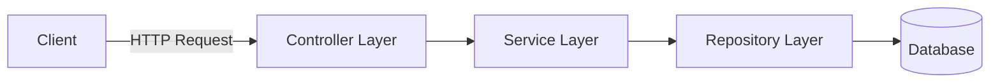

# 🏨 Reservation Service


**Reservation Service** is a Spring Boot REST application for managing room reservations.

The service supports creating, updating, approving, and cancelling reservations while enforcing business rules such as date validation and reservation status transitions.

## ✨ Features

- Create and manage room reservations
- Update pending reservations
- Approve reservations
- Cancel reservations
- Validate incoming requests with Jakarta Validation
- Manage reservation lifecycle and status transitions
- Global exception handling
- Structured API error responses
- Application logging with SLF4J

## 🧱 Architecture

The application follows a traditional layered backend architecture with clear separation of responsibilities.



### Controller Layer

Handles incoming HTTP requests and exposes the REST API.

### Service Layer

Contains the main business logic, including:

- Reservation date validation
- Reservation status management
- Allowed state transitions
- Reservation processing

### Repository Layer

Provides persistence operations through **Spring Data JPA** and **Hibernate**.

## ⚙️ Tech Stack

| Category | Technologies |
|---|---|
| Language | Java 17+ |
| Framework | Spring Boot |
| Web | Spring Web |
| Persistence | Spring Data JPA, Hibernate |
| Validation | Jakarta Validation |
| Logging | SLF4J |
| Build Tool | Maven |

## 🔗 REST API

| Method | Endpoint | Description |
|---|---|---|
| `GET` | `/res` | Get all reservations |
| `GET` | `/res/{id}` | Get reservation by ID |
| `POST` | `/res/post` | Create a new reservation |
| `PUT` | `/res/{id}` | Update a reservation |
| `POST` | `/res/{id}/approve` | Approve a reservation |
| `DELETE` | `/res/{id}/cancel` | Cancel a reservation |

## 📋 Business Rules

The service enforces several rules to keep reservation data consistent.

### Date Validation

A reservation must have a valid date range:

```text
startDate <= endDate
```

### Reservation Status

Each reservation can have one of the following statuses:

```text
PENDING
APPROVED
CANCELLED
```

Allowed status transitions:

```text
PENDING ──────► APPROVED
    │
    └─────────► CANCELLED
```

Only reservations with the `PENDING` status can be updated.

Approved reservations cannot be cancelled.

## ▶️ Quick Start

### 1. Clone the repository

```bash
git clone https://github.com/Dolkisss/Reservation_project.git
cd Reservation_project
```

### 2. Build the project

Linux / macOS:

```bash
./mvnw clean install
```

Windows:

```bash
mvnw.cmd clean install
```

### 3. Run the application

Linux / macOS:

```bash
./mvnw spring-boot:run
```

Windows:

```bash
mvnw.cmd spring-boot:run
```

The application starts at:

```text
http://localhost:8080
```

## 👨‍💻 Author

**Dolkisss**

GitHub: [github.com/Dolkisss](https://github.com/Dolkisss)
