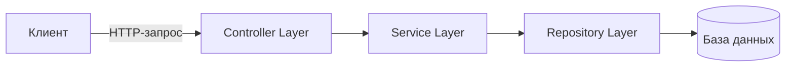

# 🏨 Reservation Service

**Reservation Service** — это REST-приложение на Spring Boot для управления бронированием помещений.

Сервис поддерживает создание, обновление, подтверждение и отмену бронирований с соблюдением бизнес-правил, таких как проверка корректности дат и допустимых переходов между статусами бронирования.

## ✨ Возможности

- Создание и управление бронированиями помещений
- Обновление бронирований со статусом `PENDING`
- Подтверждение бронирований
- Отмена бронирований
- Валидация входящих запросов с помощью Jakarta Validation
- Управление жизненным циклом бронирования и переходами между статусами
- Глобальная обработка исключений
- Структурированные ответы API с информацией об ошибках
- Логирование приложения с помощью SLF4J

## 🧱 Архитектура

Приложение построено на основе традиционной многоуровневой backend-архитектуры с чётким разделением ответственности между слоями.



### Controller Layer

Обрабатывает входящие HTTP-запросы и предоставляет REST API.

### Service Layer

Содержит основную бизнес-логику, включая:

- Валидацию дат бронирования
- Управление статусами бронирования
- Проверку допустимых переходов между статусами
- Обработку бронирований

### Repository Layer

Обеспечивает операции сохранения и получения данных с использованием **Spring Data JPA** и **Hibernate**.

## ⚙️ Технологический стек

| Категория | Технологии |
| --- | --- |
| Язык | Java 17+ |
| Фреймворк | Spring Boot |
| Web | Spring Web |
| Работа с данными | Spring Data JPA, Hibernate |
| Валидация | Jakarta Validation |
| Логирование | SLF4J |
| Система сборки | Maven |

## 🔗 REST API

| Метод | Endpoint | Описание |
| --- | --- | --- |
| `GET` | `/res` | Получить все бронирования |
| `GET` | `/res/{id}` | Получить бронирование по ID |
| `POST` | `/res/post` | Создать новое бронирование |
| `PUT` | `/res/{id}` | Обновить бронирование |
| `POST` | `/res/{id}/approve` | Подтвердить бронирование |
| `DELETE` | `/res/{id}/cancel` | Отменить бронирование |

## 📋 Бизнес-правила

Сервис применяет ряд правил, обеспечивающих целостность и корректность данных бронирований.

### Валидация дат

Бронирование должно иметь корректный диапазон дат:

```text
startDate <= endDate
```

### Статусы бронирования

Каждое бронирование может находиться в одном из следующих статусов:

```text
PENDING
APPROVED
CANCELLED
```

Допустимые переходы между статусами:

```text
PENDING ──────► APPROVED
    │
    └─────────► CANCELLED
```

Обновлять можно только бронирования со статусом `PENDING`.

Подтверждённые бронирования нельзя отменить.

## ▶️ Быстрый старт

### 1. Клонирование репозитория

```bash
git clone https://github.com/Dolkisss/Reservation_project.git
cd Reservation_project
```

### 2. Сборка проекта

Linux / macOS:

```bash
./mvnw clean install
```

Windows:

```bash
mvnw.cmd clean install
```

### 3. Запуск приложения

Linux / macOS:

```bash
./mvnw spring-boot:run
```

Windows:

```bash
mvnw.cmd spring-boot:run
```

После запуска приложение будет доступно по адресу:

```text
http://localhost:8080
```

## 👨‍💻 Автор

**Dolkisss**

GitHub: [github.com/Dolkisss](https://github.com/Dolkisss)
